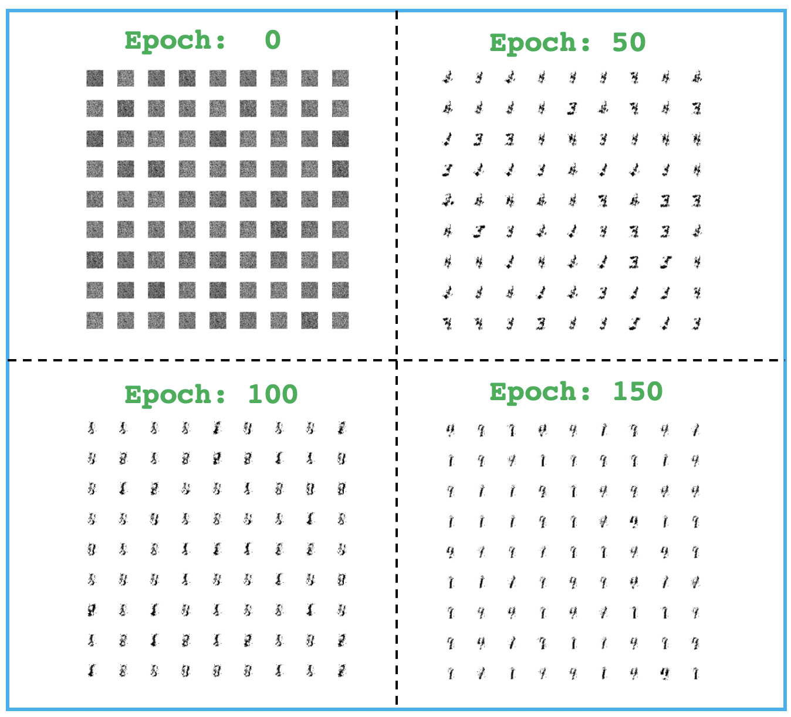
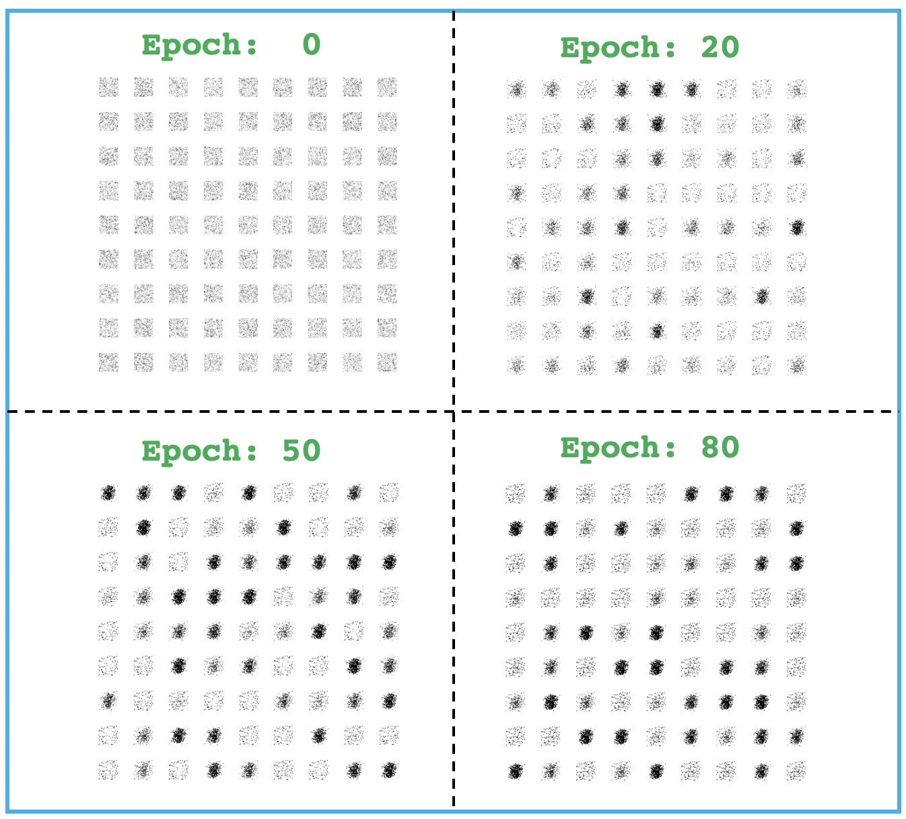
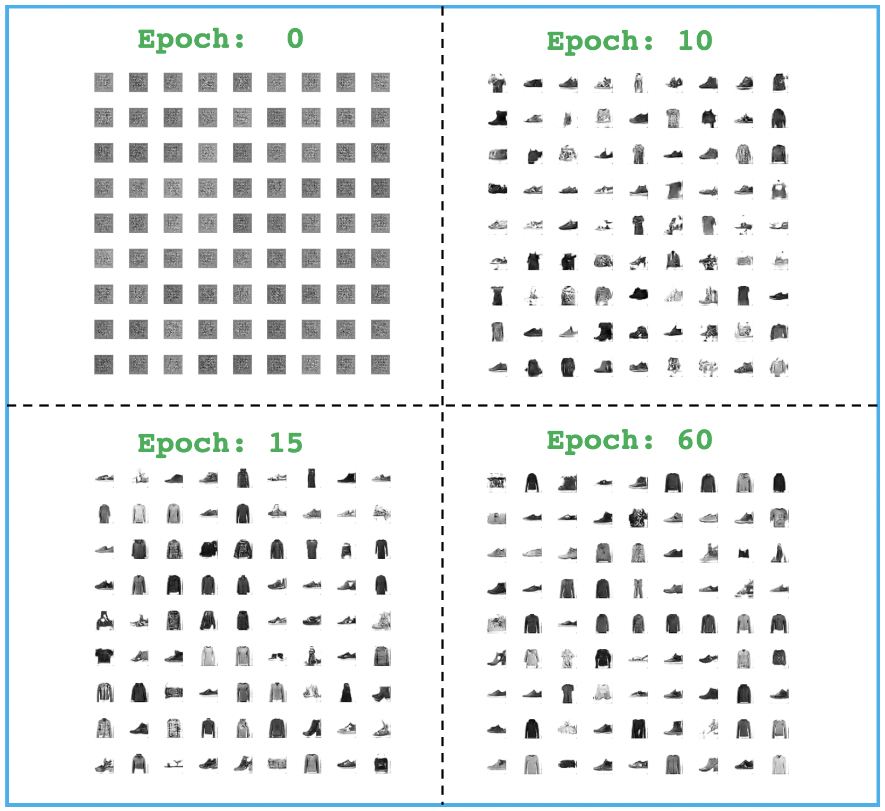
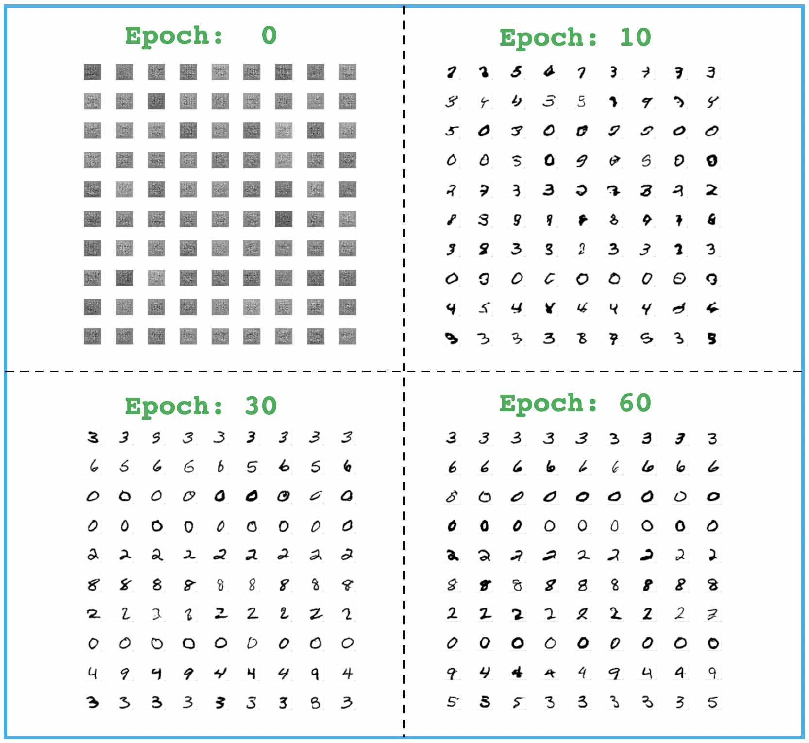
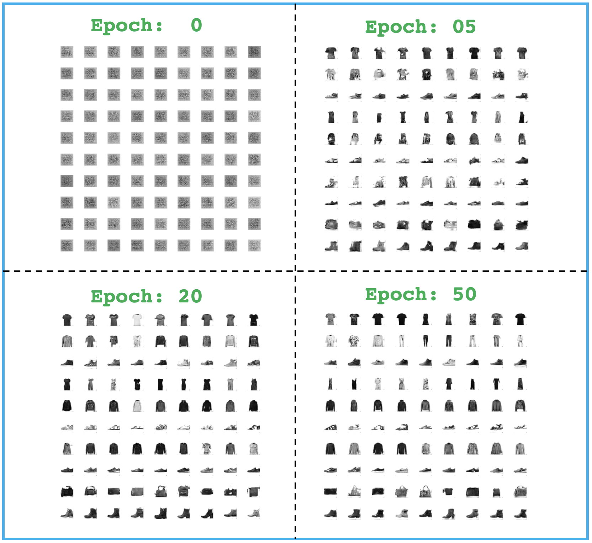
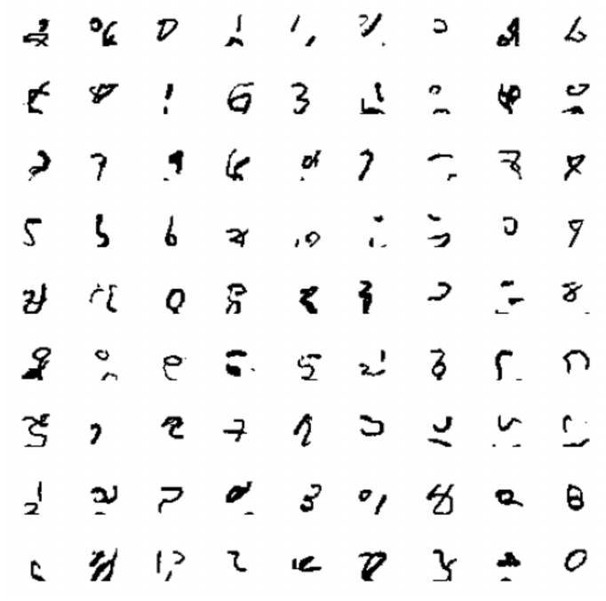
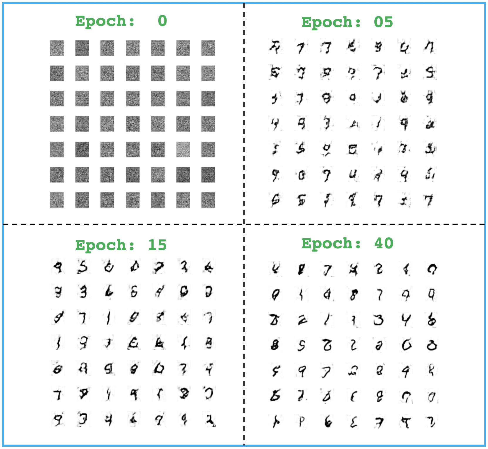
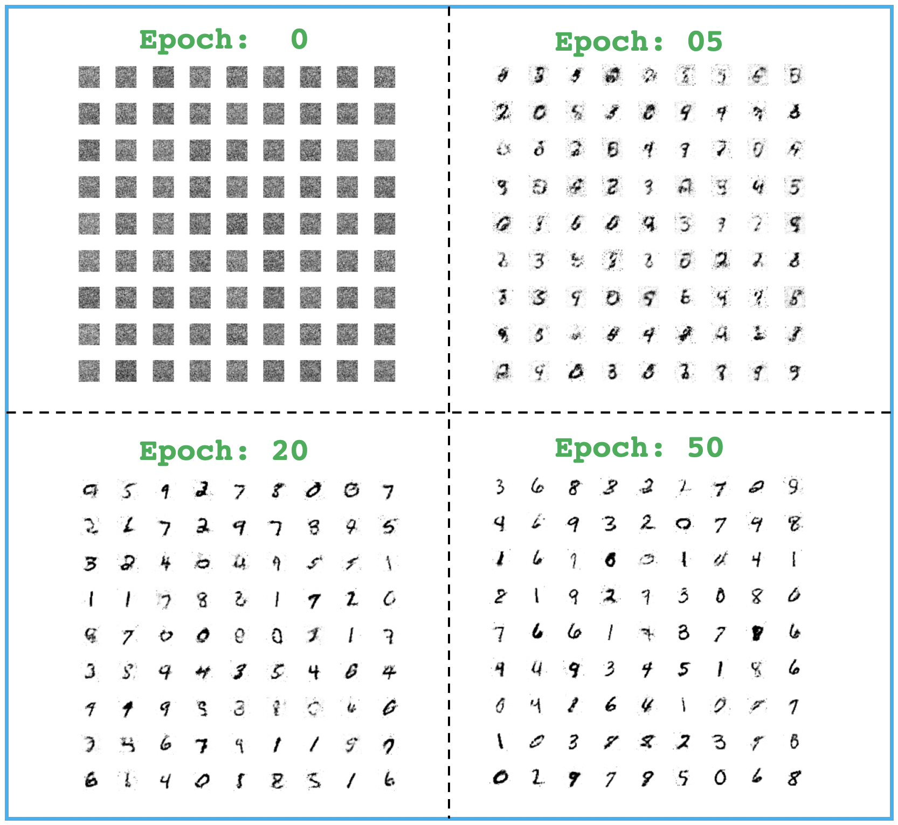

# TF2-Keras-GAN-Notebooks

## Topics

* [Variational AutoEncoder](#Variational-AutoEncoder)
* [Simple GAN](#Simple-GAN)
* [DCGAN for Fashion MNIST](#DCGAN-Fashion-MNIST)
* [DCGAN for Anime Faces](#DCGAN-Anime-Faces)
* [DCGAN for Celebrity Faces](#DCGAN-Celebrity-Faces)
* [Mode Collapse Example](#Mode-Collapse-Failure-in-GANs)
* [Convergence Failure Example](#Convergence-Failure-in-GANs)
* [Conditional GAN (CGAN)](#CGAN)
* [Semi Supervised GAN (SGAN)](#Semi-Supervised-GAN-or-SGAN)
* [InfoGAN](#InfoGAN)
* [Auxiliary Classifier GAN](#Auxiliary-Classifier-GAN-or-ACGAN)
* [Pixel CNN](#Pixel-CNN)
* [Wasserstein GAN (WGAN)](#Wasserstein-GAN-or-WGAN)
* [Least Squares GAN (LSGAN)](#Least-Squares-GAN-or-LSGAN)
* [Improved WGAN (WGAN-GP)](#Improved-WGAN-or-WGAN-GP)

## Implementation and Results

### Variational-AutoEncoder

[Notebook](vae/Variational-Autoencoder.ipynb)

    

### Simple-GAN

[Notebook](gan/Generative-Adversarial-Network.ipynb)

    

### DCGAN-Fashion-MNIST

[Notebook](dcgan/DC-GAN-Fashion-MNIST.ipynb)

    

### DCGAN-Anime-Faces

[Notebook](dcgan/DC-GAN-Anime.ipynb)

    

### DCGAN-Celebrity-Faces

[Notebook](dcgan/DC-GAN-Celeb.ipynb)

    

### Mode-Collapse-Failure-in-GANs

[Notebook](gan-failures/Mode-Collapse.ipynb)

    

### Convergence-Failure-in-GANs

[Notebook](gan-failures/Convergence-Failure.ipynb)

    

### CGAN

[Notebook](cgan/Conditional-GAN-(CGAN).ipynb)

    

### Semi-Supervised-GAN-or-SGAN

[Notebook](sgan/Semi-Supervised-GAN-(SGAN).ipynb)

    

### InfoGAN

[Notebook](infogan/Info-GAN.ipynb)

    

### Auxiliary-Classifier-GAN-or-ACGAN

[Notebook](acgan/Auxiliary-Classifier-GAN-(ACGAN).ipynb)

    

### Pixel-CNN

[Notebook](pixel-cnn/Pixel-CNN-for-MNIST.ipynb)

    

### Wasserstein-GAN-or-WGAN

[Notebook](wgan/W-GAN.ipynb)

    

### Least-Squares-GAN-or-LSGAN

[Notebook](lsgan/LS-GAN.ipynb)

    

### Improved-WGAN-or-WGAN-GP

[Notebook](wgan-gp/W-GAN-GP-TF-v1.14.ipynb)

    

