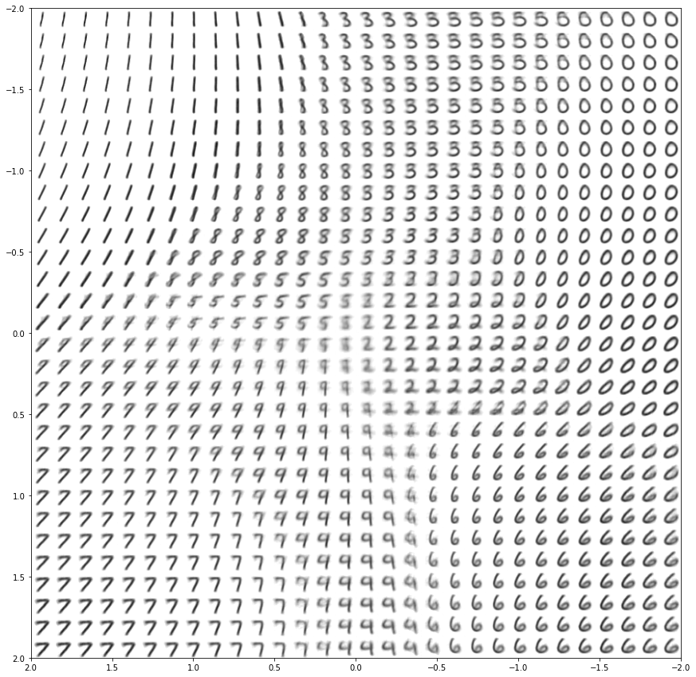
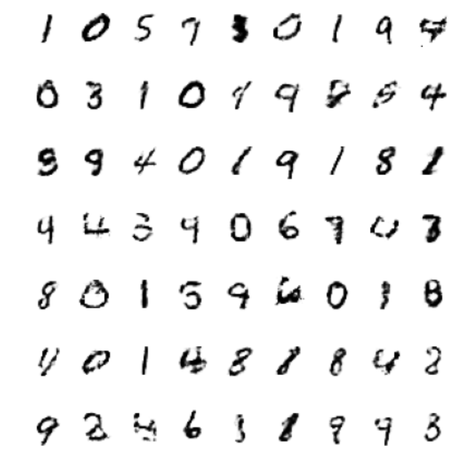
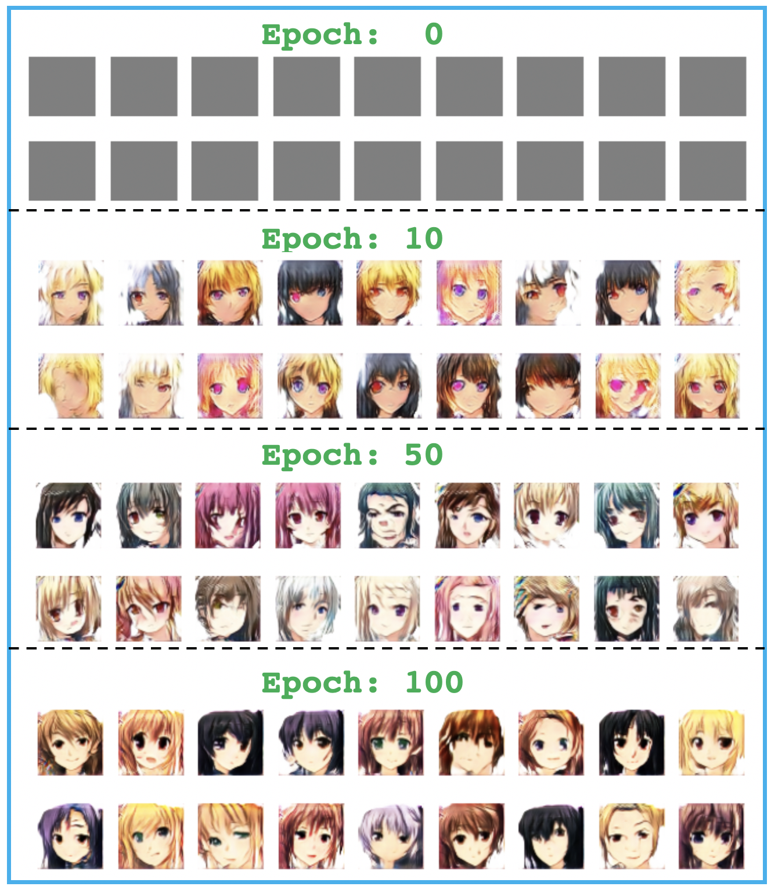
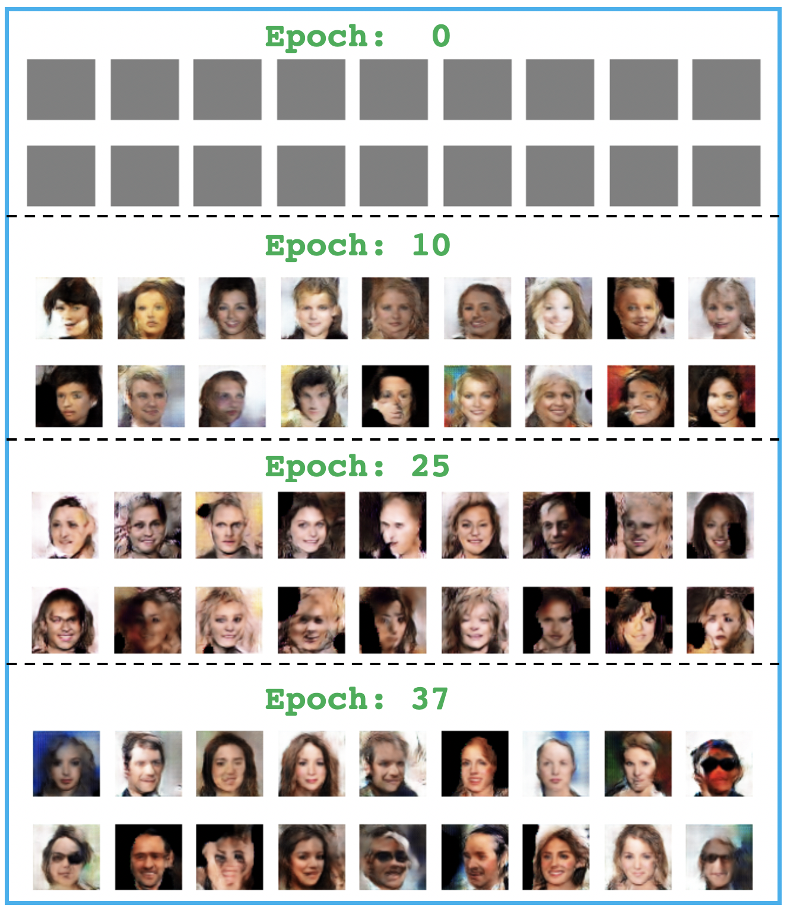

# TF2-Keras-GAN-Notebooks

## Topics

- Variational AutoEncoder
- Simple GAN

## Implementation and Results

### Variational AutoEncoder

[Notebook](vae/Variational-Autoencoder.ipynb)

    

### Simple GAN

[Notebook](gan/Generative-Adversarial-Network.ipynb)

    

### DCGAN Fashion MNIST

[Notebook](dcgan/DC-GAN-Fashion-MNIST.ipynb)

    

### DCGAN-Anime Faces

[Notebook](dcgan/DC-GAN-Anime.ipynb)

    

### DCGAN Celebrity Faces

[Notebook](dcgan/DC-GAN-Celeb.ipynb)

    

